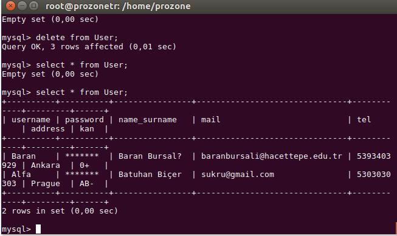
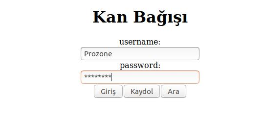
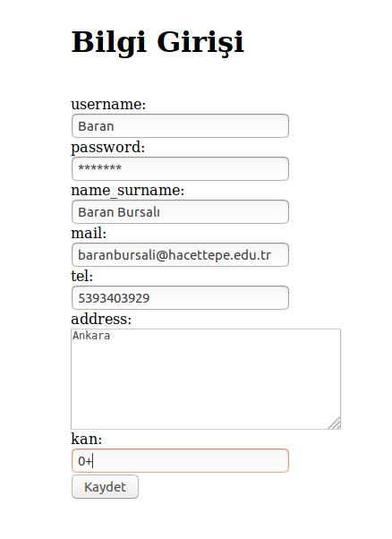
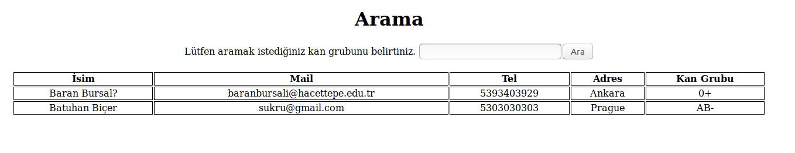

# Kan-Bagisi
JSF  
In DBUtil, you must change connection = DriverManager.getConnection("jdbc:mysql://localhost:3306/product", "root", "yourpass");
according to your database. 	
Here mysql used. 

